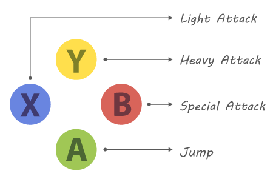

# Command

## Classification
> Purpose: Behavioural  
> Scope: Object

## Description
A function encapsulated inside of an object.

Turn a function into an object (using some predefined interface) so it can be manipulated in several ways.

## Similar Concepts
 - Callbacks
 - Function pointer
 - Closure
 - Partially applied function

## Roadmap
 1. Define a common interface for all Commands. It should contain at least an *"execute()"* method.
 1. For each different command, create a class that implements Command interface. The actual function to be invoked (the encapsulated one) should be inside the body of *execute()*.
 1. Invoke the encapsulated function through the interface, by invoking *execute()*.

## When should I use it?
 - When creation and execution of a request are not dependent on each other.
 - When you want to decouple **Invoker** from **Implementer**.
 - When you want to delegate the request to some third party entity.
 - When you want an asynchronous invocation.
 - When you want to parameterize the request.
 - When you want to queue the request.
 - When you want to log the request.
 - When you want to be able to undo the request.

## Real Scenario
### Editable User Input
We need to code a configurable controller (the user can edit it through some "Options" menu) but the actions are coupled to gamepad logic, as seen below:



```csharp
void ProcessInput (ref Player playerReference)
{
    if (Input.GetKeyDown("BUTTON_A"))
        playerReference.Jump();
    
    if (Input.GetKeyDown("BUTTON_B"))
        playerReference.SpecialAttack();

    if (Input.GetKeyDown("BUTTON_X"))
        playerReference.LightAttack();

    if (Input.GetKeyDown("BUTTON_Y"))
        playerReference.HeavyAttack();
}
```

### Applying Command pattern
[Sources below also found here!](./src)

 1. Define a Command interface  
```csharp
public interface ICommand
{
    void execute (ref Player playerReference);
}
```

 2. Implement (several) desired commands  
```csharp
class JumpCommand : ICommand
{
    public void execute (ref Player playerReference) {
        playerReference.Jump();
    }
}

class SpecialAttackCommand : ICommand
{
    public void execute (ref Player playerReference) {
        playerReference.SpecialAttack();
    }
}

class LightAttackCommand : ICommand
{
    public void execute (ref Player playerReference) {
        playerReference.LightAttack();
    }
}
```

 3. Handle inputs through abstract interface  
```csharp
class InputManager
{
    private ICommand buttonA;
    private ICommand buttonB;
    private ICommand buttonX;
    private ICommand buttonY;

    public ICommand ProcessInput ()
    {
        if (Input.GetKeyDown("BUTTON_A")) return buttonA;
        if (Input.GetKeyDown("BUTTON_B")) return buttonB;
        if (Input.GetKeyDown("BUTTON_X")) return buttonX;
        if (Input.GetKeyDown("BUTTON_Y")) return buttonY;

        return null;
    }
}
```

 4. Assign Commands dynamically  
```csharp
InputManager inputManager = new Inputmanager ();
ICommand currentButton;
Player player1 = new Player ();

// Initializes Commands
void Awake ()
{
    inputManager.buttonA = new JumpCommand ();
    inputManager.buttonB = new SpecialAttackCommand ();
    inputManager.buttonX = new LightAttackCommand ();
    inputManager.buttonY = new HeavyAttackCommand ();
}

// Game Loop
void Update ()
{
    currentButton = inputManager.ProcessInput();
    if (currentButton != null)
        currentButton.execute(player1);
}
```